# Cellular-Automata Gallery

A rendered PNG for each canonical built-in rule, generated reproducibly by
[`scripts/regen_gallery.sh`](../../scripts/regen_gallery.sh) (which builds and
runs [`Examples/ca_gallery_gen.cc`](../../Examples/ca_gallery_gen.cc)).

> Stochastic and continuous rules (Forest Fire, Gray-Scott, Ising, SIR,
> Schelling) are demonstrated quantitatively with reference figures in
> [`reproductions/`](../../reproductions/README.md) rather than here.

To regenerate after changing the renderer or a rule:

```bash
scripts/regen_gallery.sh
```

## Life-like outer-totalistic rules

Each panel is a 96×96 toroidal grid evolved from a deterministic random soup
with [`Outer_Totalistic_Rule`](../../tpl_ca_rule.H). See
[tutorial 02 — custom rules](../tutorial/02_custom_rule.md).

<table>
<tr>
  <td align="center">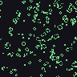<br><b>Conway</b><br><code>B3/S23</code></td>
  <td align="center">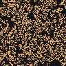<br><b>HighLife</b><br><code>B36/S23</code></td>
  <td align="center"><br><b>Day &amp; Night</b><br><code>B3678/S34678</code></td>
  <td align="center">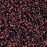<br><b>Seeds</b><br><code>B2/S</code></td>
</tr>
<tr>
  <td align="center">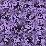<br><b>Maze</b><br><code>B3/S12345</code></td>
  <td align="center">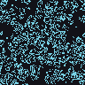<br><b>2×2</b><br><code>B36/S125</code></td>
  <td align="center">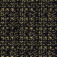<br><b>Replicator</b><br><code>B1357/S1357</code></td>
  <td align="center">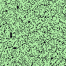<br><b>Life without Death</b><br><code>B3/S012345678</code></td>
</tr>
</table>

## Elementary Wolfram rules (space-time diagrams)

Each panel is a 201-cell row evolved from a single central impulse with
[`make_wolfram_engine`](../../ca-engine-utils.H); rows run top-to-bottom in
time. See [tutorial 01 — your first CA](../tutorial/01_first_ca.md).

<table>
<tr>
  <td align="center">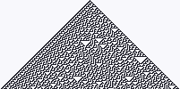<br><b>Rule 30</b><br>chaotic</td>
  <td align="center">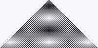<br><b>Rule 54</b><br>class IV</td>
  <td align="center">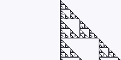<br><b>Rule 60</b><br>Sierpinski (left)</td>
  <td align="center">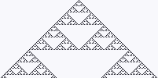<br><b>Rule 90</b><br>Sierpinski (XOR)</td>
</tr>
<tr>
  <td align="center">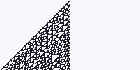<br><b>Rule 110</b><br>Turing-complete</td>
  <td align="center">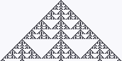<br><b>Rule 150</b><br>additive</td>
  <td align="center">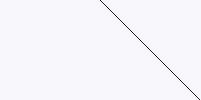<br><b>Rule 184</b><br>traffic</td>
  <td align="center"><br><b>Rule 250</b><br>simple</td>
</tr>
</table>